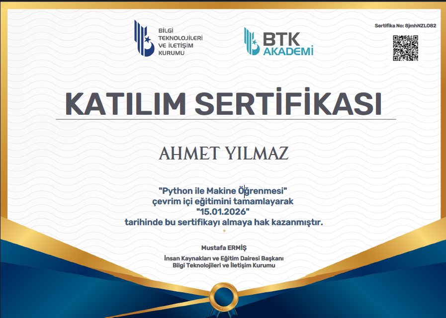
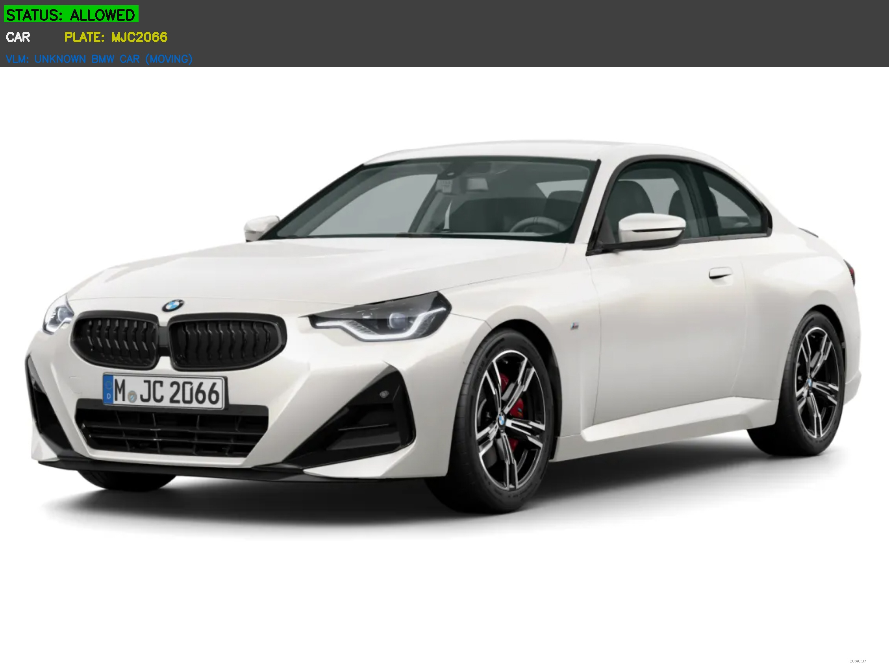
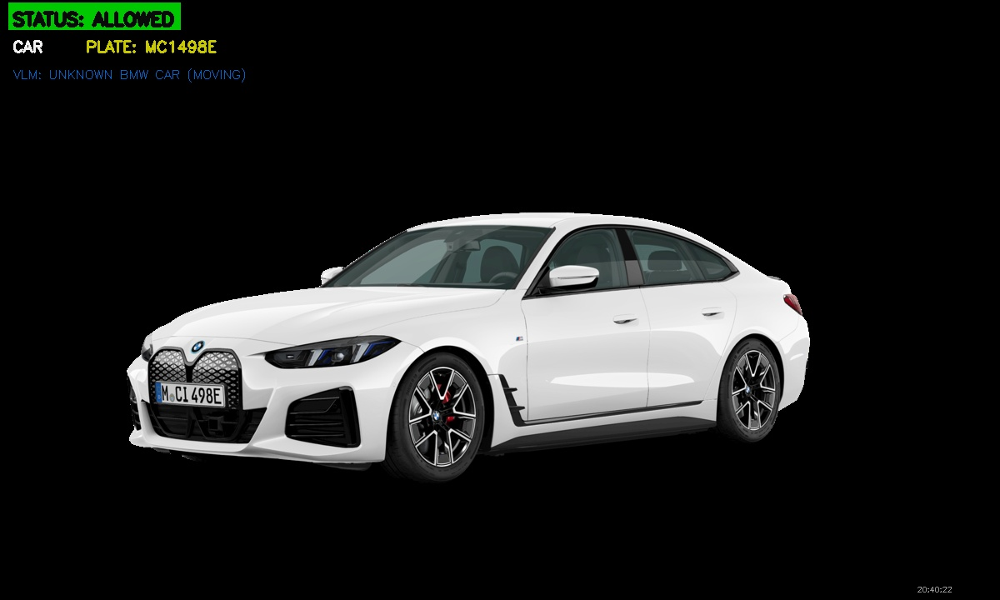
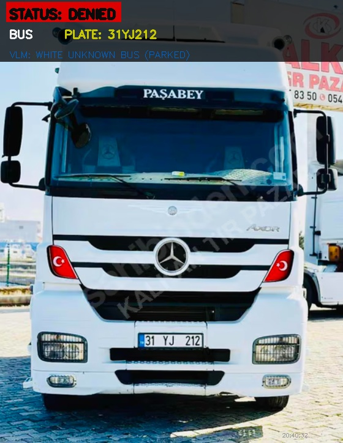
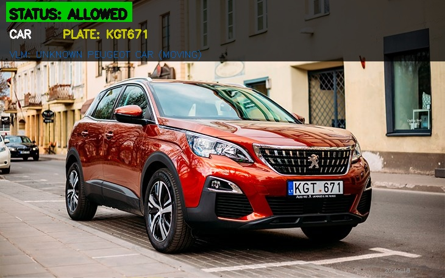

# Araç Plaka Tanıma ve Güvenlik Sistemi

Bu proje, Görsel Dil Modelleri (VLM) dersi kapsamında geliştirilmiş bir projedir. Amacım, bir güvenlik noktasından geçen araçları otomatik olarak tanıyarak, plaka analizi yapan ve yetkilendirme işlemlerini gerçekleştiren bir sistem kurmaktı.

## Projenin Amacı

Bu sistem, modern bilgisayarlı görü ve derin öğrenme tekniklerini kullanarak aşağıdaki işlemleri başarıyla gerçekleştirir:

1.  **Araç Tipi Tespiti:** Görüntüdeki aracın türünü (otomobil, otobüs, kamyonet vb.) belirler.
2.  **Plaka Tespiti ve Okuma (OCR):** Araç üzerindeki plakayı tespit eder ve metnini okur.
3.  **Detaylı Araç Analizi (VLM):** Aracın rengi, markası ve durumu gibi görsel detayları analiz etmek için BLIP modeli kullanılır.
4.  **Yetkilendirme ve Kayıt:** Okunan plakayı veritabanındaki izinli plakalar listesiyle karşılaştırarak geçişe onay veya ret kararı verir. Bütün geçiş denemeleri veritabanına kaydedilir.

## Proje Yapısı

```
VLM_Final_Projesi/
├── main.py                          # Sistemin ana çalışma dosyası
├── app.py                           # Streamlit web arayüzü
├── database.py                      # Veritabanı işlemleri
├── yolo_train.py                    # YOLOv8 araç tipi sınıflandırma eğitimi
├── requirements.txt                 # Gerekli Python kütüphaneleri
├── guvenlik_sistemi.db              # SQLite veritabanı
├── models/                          # Eğitilmiş derin öğrenme modelleri
├── images/                          # Test resimleri
├── dataset/                         # Eğitim veri seti
└── README.md                        # Bu dosya
```

## Teknik İş Akışı

1.  **Başlatma:** `main.py` veya `app.py` çalıştığında veritabanını kontrol eder, tablolar yoksa oluşturur ve örnek izinli plakaları ekler.
2.  **Araç Tespiti:** YOLOv8 COCO modeli kullanılarak görüntüdeki araçlar tespit edilir.
3.  **Plaka Tespiti ve OCR:** Plaka bölgesi tespit edilir ve EasyOCR ile okunur.
4.  **VLM Analizi:** BLIP modeli ile araç hakkında metinsel bir açıklama üretilir.
5.  **Karar ve Kayıt:** Plaka veritabanında sorgulanır ve verilen karara göre geçiş işlemi kaydedilir.
6.  **Görselleştirme:** Sonuçlar, `main.py` çalıştırıldığında ekranda gösterilir ve `outputs/` klasörüne kaydedilir. `app.py` kullanıldığında ise web arayüzünde gösterilir.

## Koddan Önemli Kısımlar

Burada projenin daha iyi anlaşılması için bazı önemli kod bloklarını açıklamak istedim.

### Plaka Okuma Fonksiyonu

`plaka_oku_coklu_deneme` fonksiyonu, plaka okuma işleminin en önemli kısmıdır. Bu fonksiyonda, plaka görüntüsü birkaç farklı ön işleme tekniği ile iyileştirilir ve her bir versiyon EasyOCR ile okunur. En sonunda, en güvenilir sonuç seçilir.

```python
def plaka_oku_coklu_deneme(plate_img):
    for img in islenmis_gorseller:
        try:
            sonuc = ocr_reader.readtext(
                img,
                allowlist='0123456789ABCDEFGHJKLMNPRSTUVWXYZ',
                detail=1,
                paragraph=False,
                width_ths=0.8,
                height_ths=0.8,
                decoder='beamsearch',
                contrast_ths=0.4,
                adjust_contrast=0.5
            )

            for bbox, text, prob in sonuc:
                if prob > 0.4:
                    adaylar.append((formatted_plate, prob))
        except Exception as e:
            continue
    
```

### VLM Analiz Fonksiyonu

`vlm_ile_arac_analizi` fonksiyonu, BLIP modelini kullanarak araç hakkında görsel bir analiz yapar. Bu sayede, aracın rengi, markası ve durumu hakkında bilgi elde ederiz.

```python
def vlm_ile_arac_analizi(image_path, arac_tipi):
    image = Image.open(image_path).convert('RGB')
    inputs = vlm_processor(image, return_tensors="pt").to(DEVICE)

    with torch.no_grad():
        out = vlm_model.generate(**inputs, max_length=50)

    caption = vlm_processor.decode(out[0], skip_special_tokens=True)
    
```

## Kurulum

Projeyi çalıştırmadan önce aşağıdaki adımları izlemeniz gerekmektedir.

### 1. Sanal Ortam Oluşturun (Tavsiye Edilir)

**Windows:**

```bash
python -m venv venv
venv\Scripts\activate
```

### 2. Kütüphaneleri Yükleyin

```bash
pip install -r requirements.txt
```

## Kullanım

### Komut Satırı ile Kullanım

`images` klasöründeki tüm resimleri işlemek için:

```bash
python main.py
```

### Web Arayüzü ile Kullanım

Web arayüzünü başlatmak için:

```bash
streamlit run app.py
```

## Ekran Görüntüleri

Sistemin çalışmasından bazı örnekler:

### Tüm Çıktılar




